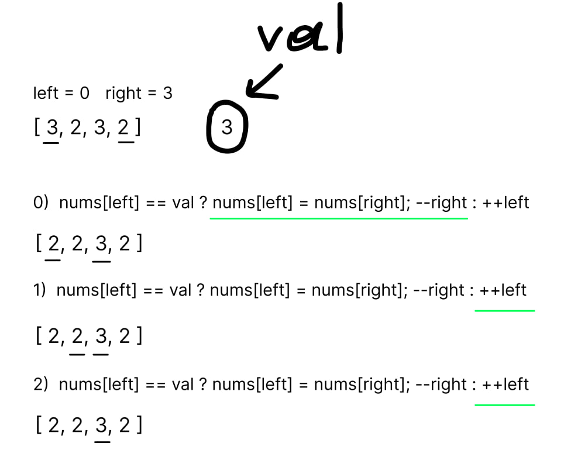
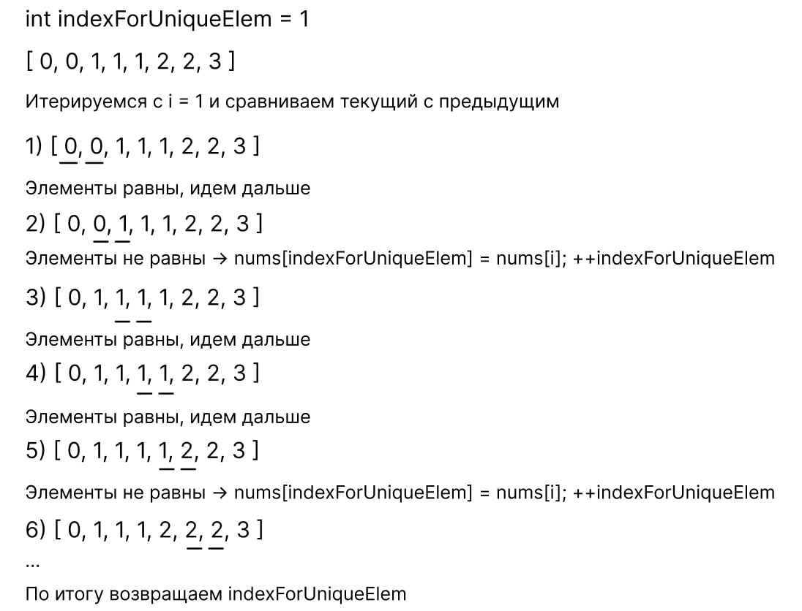
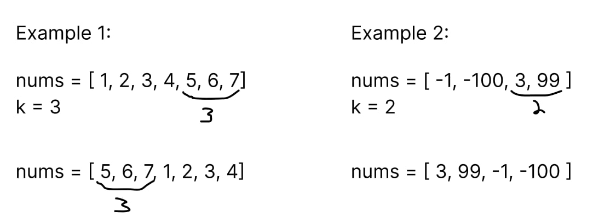
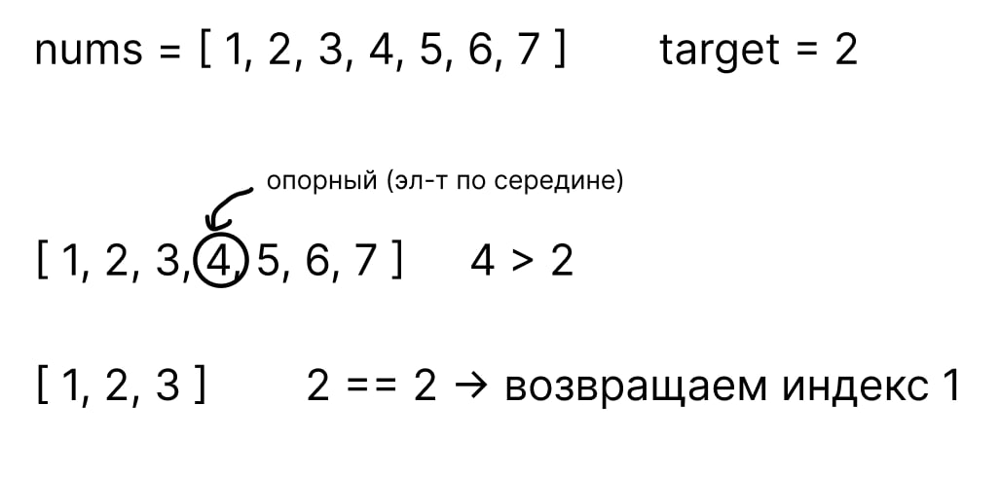
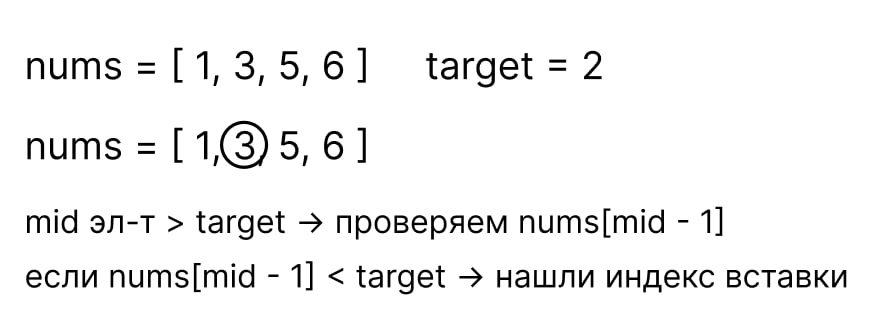

## LeetCode 150 top tasks

### 88. Merge Sorted Array

Даны два целочисленных массива, nums1 и nums2 отсортированные в порядке возрастания и также даны два числа, число m для первого массива, отображающее количество нулей, равных количеству чисел в nums2 (это число n)

Нули в первом массиве необходимы для того, чтобы вместо них расположить в первом массиве элементы из второго массива, но так чтобы итоговый мутированный массив nums1 остался отсортированным

Пример
```c++
nums1 = {1, 2, 3, 0, 0, 0}, m = 3
nums2 = {2, 5, 6}, n = 3

merge(nums1, m, nums2, n)
nums1 = {1, 2, 2, 3, 5, 6}
```

[Подробное описание](https://leetcode.com/problems/merge-sorted-array/description/?envType=study-plan-v2&envId=top-interview-150)

Основная идея это итерация с конца массива, необходимо сравнить последний (ненулевой) элемент из первого массива с последним элементом из второго массива и в случае если первый элемент меньше либо равен, записать на место последнего нуля в nums1 последний элемент из nums2 (т.к. он будет максимальным), сдвинуть указатель m для того чтобы сравнивать следующий элемент из nums1 и указатель indexToWrite

К примеру 
```c++
nums1 = {1, 2, 3, 0, 0, 0}, m = 3
nums2 = {2, 5, 6}, n = 3

int indexToWrite = nums1.size() - 1; /// последний элемент nums1 равный нулю

if (nums1[m - 1] <= nums2[n - 1] ) {
    nums1[indexToWrite] = nums2[n - 1];
    --m;
    --indexToWrite;
}
```

Но что делать в случае, когда элемент из первого массива оказался больше?

Разберем более простой пример

```c++
nums1 = {9, 0}, m = 1
nums2 = {6}, n = 1
```

В таком случае необходимо вместо текущего элемента [indexToWrite] записать nums1[m - 1], то есть получится 
```c++
nums1 = {9, 9}
```

И уже в следующем цикле до тех пор пока указатель n > 0 записывать в nums1[indexToWrite] элемент nums2[n - 1]

В данном примере когда nums1 = {9, 9} указатель n равен 1 и цикл 
```c++
while (n > 0) {
    nums1[indexToWrite] = nums2[n - 1];
    --n;
    --indexToWrite;
}
```

Сделает массив nums1
```c++
nums1 = {6, 9}
```

#### Solution
```c++
void merge(vector<int>& nums1, int m, vector<int>& nums2, int n) {
    int indexToWrite = nums1.size() - 1;

    /// до тех пор пока есть что сравнивать
    while (n > 0 && m > 0) {
        if (nums1[m - 1] <= nums2[n - 1]) {
            nums1[indexToWrite] = nums2[n - 1];
            --n;
        }
        else {
            nums1[indexToWrite] = nums1[m - 1];
            --m;
        }

        --indexToWrite;
    }

    while (n > 0) {
        nums1[indexToWrite] = nums2[n - 1];
        --n;
        --indexToWrite;
    }
}
```

### 27. Remove Element

Дан целочисленный массив nums и число val, необходимо убрать все вхождения val in place и вернуть количество оставшихся элементов.

In place - означает, что метод должен работать напрямую с переданной по ссылке структурой без создания вспомогательных структур и аллокаций доп памяти.

Пример
```c++
Input: nums = [3,2,2,3], val = 3
Output: 2, nums = [2,2,_,_]

Explanation: Your function should return k = 2, with the first two elements of nums being 2.
It does not matter what you leave beyond the returned k (hence they are underscores).
```

[Подробное описание](https://leetcode.com/problems/remove-element/description/?envType=study-plan-v2&envId=top-interview-150)

Для решения используем классический алогоритм двух указателей, один будет указывать на начало, другой на конец массива

```c++
int left = 0;
int right = nums.size() - 1;
```

Сравним первый элемент с переданным val и в случае если первый элемент равен val, поменяем его местами с последним элементом и сдвинем указатель right назад, если же первый элемент не равен val, сдвигаем указатель left вперед.

Итерируемся до тех пор, пока left <= right.

Рассмотрим на примере



#### Solution
```c++
int removeElement(vector<int>& nums, int val) {
        int left = 0;
        int right = nums.size() - 1;

        while (left <= right) {
            if (nums[left] == val) {
                nums[left] = nums[right];
                --right;
            } else {
                ++left;
            }
        }

        return left;
}   
```

### 26. Remove Duplicates from Sorted Array

Дан целочисленный массив nums, отсортированный в порядке возрастания, необходимо удалить дубли "на месте" причем так, чтобы массив остался отсортированным и вернуть число уникальных элементов. Как и в предыдущей задаче, неважно что за элементы будут содержаться после уникальных

[Подробное описание](https://leetcode.com/problems/remove-duplicates-from-sorted-array/?envType=study-plan-v2&envId=top-interview-150)

**Пример 1**
```c++
Input: nums = [1,1,2]
Output: 2, nums = [1,2,_]

Explanation: Your function should return k = 2, with the first two elements of nums being 1 and 2 respectively.
It does not matter what you leave beyond the returned k (hence they are underscores).
```

**Пример 2**
```c++
Input: nums = [0,0,1,1,1,2,2,3,3,4]
Output: 5, nums = [0,1,2,3,4,_,_,_,_,_]

Explanation: Your function should return k = 5, with the first five elements of nums being 0, 1, 2, 3, and 4 respectively.
It does not matter what you leave beyond the returned k (hence they are underscores).
```

**Алгоритм**

Пройдемся обычным циклом по всему массиву, сравнивая текущий и предыдущий элемент, предварительно создав указатель для отслеживания позиции (indexForUniqueElem = 1), на которую нужно вставить уникальный элемент

Итерироваться будем с индекса 1, т.к. элемент под индексом 0 всегда уникальный

К примеру имеем массив 

```c++
nums = [1,1,2]
```

Сравниваем текущей элемент итерации с предыдущим и в случае, если они не равны, записываем в nums[indexForUniqueElem] = nums[i] и сдвигаем указатель ++indexForUniqueElem

В противном случае ничего не делаем

Рассмотрим алгоритм на следующем примере 



### 80. Remove Duplicates from Sorted Array II

Пока что пропустил

### 169. Majority Element

Дан целочисленный массив nums, необходимо вернуть наиболее часто встречающийся элемент (элемент, который появляется более ⌊n / 2⌋ раз, где n - размер массива).

[Подробное описание](https://leetcode.com/problems/majority-element/?envType=study-plan-v2&envId=top-interview-150)

**Пример 1**
```c++
Input: nums = [3,2,3]
Output: 3
```

**Пример 2**
```c++
Input: nums = [2,2,1,1,1,2,2]
Output: 2
```

Решим с помощью hashMap (словарь на основе хэш таблицы) просто посчитав кол-во вхождений каждого числа

```c++
int majorityElement(vector<int>& nums) {
    unordered_map<int, int>hash;
    int majority = nums.size() / 2;
    
    for (int i = 0; i < nums.size(); ++i) {
        ++hash[nums[i]];
        if (hash[nums[i]] > majority) {
            return nums[i];
        }
    }
    
    return -1;
}
```

### 189. Rotate Array

Дан целочисленный массив nums, необходимо "перевернуть" его заданное k количество раз

[Подробное описание](https://leetcode.com/problems/rotate-array/description/?envType=study-plan-v2&envId=top-interview-150)

**Пример 1**
```c++
Input: nums = [1,2,3,4,5,6,7], k = 3
Output: [5,6,7,1,2,3,4]

Explanation:
rotate 1 steps to the right: [7,1,2,3,4,5,6]
rotate 2 steps to the right: [6,7,1,2,3,4,5]
rotate 3 steps to the right: [5,6,7,1,2,3,4]
```

**Пример 2**
```c++
Input: nums = [-1,-100,3,99], k = 2
Output: [3,99,-1,-100]

Explanation: 
rotate 1 steps to the right: [99,-1,-100,3]
rotate 2 steps to the right: [3,99,-1,-100]
```

**Решение**

Можно сразу увидеть



Единственное, нужно учесть, что число k может быть больше размерности массива, поэтому в самом начале 

```c++
int n = nums.size();
if (n == 0) return;
k = k % n; 
```

```c++
void rotate(vector<int>& nums, int k) {
    int n = nums.size();
    if (n == 0) return;
    k = k % n; 
    
    std::vector<int> tmp;
    tmp.reserve(n); 
    
    for (int i = n - k; i < n; ++i) {
        tmp.push_back(nums[i]); 
    }
    
    for (int i = 0; i < n - k; ++i) {
        tmp.push_back(nums[i]); 
    }
    
    nums = tmp; 
    }
```

### 121. Best Time to Buy and Sell Stock

Дан целочисленный массив prices, где prices[i] - это цена акции на текущий момент.

Необходимо сначала купить и потом продать акцию (покупка и продажа осуществляется единожды!), выручив максимальную прибыль.

[Подробное описание](https://leetcode.com/problems/best-time-to-buy-and-sell-stock/submissions/1609542553/?envType=study-plan-v2&envId=top-interview-150)

**Пример 1**
```c++
Input: prices = [7,1,5,3,6,4]
Output: 5

Explanation: Buy on day 2 (price = 1) and sell on day 5 (price = 6), profit = 6-1 = 5.
Note that buying on day 2 and selling on day 1 is not allowed because you must buy before you sell.
```

**Пример 2**
```c++
Input: prices = [7,6,4,3,1]
Output: 0

Explanation: In this case, no transactions are done and the max profit = 0.
```

**Решение**

Для соблюдения условия "сначала купить - потом продать" используем обычный цикл, в первой проверке постараемся обновить минимально известную цену и уже в следующей будем из элемента текущей итерации вычитать минимально известный (это обеспечит условие, что сначала акция должна быть куплена)

```c++
class Solution {
public:
    int maxProfit(vector<int>& prices) {
        int minPrice = prices[0];
        int maxProfit = 0;

        for (int i = 1; i < prices.size(); ++i) {
            if (prices[i] < minPrice) {
                minPrice = prices[i];
            }

            if (prices[i] - minPrice > maxProfit) {
                maxProfit = prices[i] - minPrice;
            }
        }

        return maxProfit;
    }
};
```

### 122. Best Time to Buy and Sell Stock II

Дан целочисленный массив prices, где prices[i] - это цена акции на текущий момент.

Необходимо сначала купить и потом продать акцию, выручив максимальную прибыль, покупать и продавать можно неограниченное кол-во раз, причем можно купить и сразу продать (весь подвох кроется в этом условии), также в единый момент времени можно владеть лишь одной акцией.

[Подробное описание](https://leetcode.com/problems/best-time-to-buy-and-sell-stock-ii/description/?envType=study-plan-v2&envId=top-interview-150)


**Пример 1**
```c++
Input: prices = [7,1,5,3,6,4]
Output: 7

Explanation: Buy on day 2 (price = 1) and sell on day 3 (price = 5), profit = 5-1 = 4.
Then buy on day 4 (price = 3) and sell on day 5 (price = 6), profit = 6-3 = 3.
Total profit is 4 + 3 = 7.

```

**Пример 2**
```c++
Input: prices = [1,2,3,4,5]
Output: 4

Explanation: Buy on day 1 (price = 1) and sell on day 5 (price = 5), profit = 5-1 = 4.
Total profit is 4.
```

**Пример 3**
```c++
Input: prices = [7,6,4,3,1]
Output: 0

Explanation: There is no way to make a positive profit, so we never buy the stock to achieve the maximum profit of 0.
```

Суть решения заключается в этом условии:
 "вы можете купить акцию, а затем продать в этот же день" 

 Рассмотрим на примере что это значит, предположим массив prices выглядит следующим образом:

 ```c++
 prices = [1, 10, 90];
 ```

 **Решение**

 Интуитивно понятно, что самым выгодным решением будет купить акцию за одну условную единицу и продать за 90 у.е. , таким образом выручив 89 у.е.

 Можно ли как то иначе получит эту сумму?

 На самом деле да, мы можем купить акцию за 1 у.е., затем продать ее за 10 у.е. и сразу же купить за те же 10 у.е., для того чтобы потом продать ее за 90 у.е. и в результате мы получим точно такую сумму.

Теперь становится понятно, что покупать акцию нужно тогда, как есть хотя бы минимальный профит 

```c++
class Solution {
public:
    int maxProfit(vector<int>& prices) {
        int profit = 0;
        for (int i = 1; i < prices.size(); ++i) {
            if (prices[i] > prices[i - 1]) {
                profit += prices[i] - prices[i - 1];
            }
        }

        return profit;
    }
};
```

### 55. Jump Game

Дан целочисленный неотрицательный массив nums, где каждый элемент это максимальное число, на которое можно прыгнуть вперед по массиву с текущей позиции.

Необходимо вернуть true, если со стартовой позиции (нулевого элемента) можно добраться до последнего.

[Подробное описание](https://leetcode.com/problems/jump-game/description/?envType=study-plan-v2&envId=top-interview-150)


**Пример 1**
```c++
Input: nums = [2,3,1,1,4]
Output: true

Explanation: Jump 1 step from index 0 to 1, then 3 steps to the last index.
```

**Пример 2**
```c++
Input: nums = [3,2,1,0,4]
Output: false

Explanation: You will always arrive at index 3 no matter what. Its maximum jump length is 0, which makes it impossible to reach the last index.
```

 **Решение**

 Основная идея алгоритма заключается в обновлении элемента до которого нужно добраться

 Рассмотрим первый пример

 ```c++
                 j
 nums = [2,3,1,1,4]

 j - обозначает элемент до которого нужно добраться
 ```

 Можем ли мы сказать, что добравшись до j - 1 элемента, мы доберемся до j элемента?

 Да, для этого осуществим проверку

 ```c++
if (i + nums[i] >= j) j = i; // обновляем последний элемент
 ```

 В противном случае просто пропускаем.

Если до элемента можно добраться, то последним элементом (после полной итерации) будет стартовый (нулевой) элемент.

```c++
class Solution {
public:
    bool canJump(vector<int>& nums) {
        int n = nums.size();
        int currentLastPos = n - 1;
        // значение nums[nums.size() - 1] элемента неважно
        for (int i = n - 2; i >= 0; --i) {
            if (i + nums[i] >= currentLastPos) {
                currentLastPos = i;
            }
        }
    
        return currentLastPos == 0;
    }
};
```

**UPD**

Я постараюсь решить все 150 задач, но объяснения для тривиальных задач (по типу Valid Palindrome или is Subsequence) пока пропущу (возможно добавлю в дальнейшем).

### 167. Two Sum II - Input Array Is Sorted

Дан целочисленый отсортированный в порядке возрастания массив numbers (дубли могут присутствовать) и также дано число target.

Необходимо вернуть два элемента, которые в сумме дадут искомое число target.

**При этом использовать вспомогательные структуры данных нельзя, работа идет только с заданным вектором (можно создать один вектор для возврата результата).**

Прежде чем решать эту задачу, лучше сначала решить [easy](https://leetcode.com/problems/two-sum/description/?envType=study-plan-v2&envId=top-interview-150) версию, в которой использование доп структур не запрещено.

Возрващаемся к текущей задаче 

**Пример 1**
```c++
Input: numbers = [2,7,11,15], target = 9
Output: [1,2]

Explanation: The sum of 2 and 7 is 9. Therefore, index1 = 1, index2 = 2. We return [1, 2].
```

**Пример 2**
```c++
Input: numbers = [2,3,4], target = 6
Output: [1,3]

Explanation: The sum of 2 and 4 is 6. Therefore index1 = 1, index2 = 3. We return [1, 3].
```

**Пример 3**
```c++
Input: numbers = [-1,0], target = -1
Output: [1,2]

Explanation: The sum of -1 and 0 is -1. Therefore index1 = 1, index2 = 2. We return [1, 2].
```

**Решение**

Очевидно, что решить данную задачу можно полным перебором, но в таком случае сложность будет O(N^2)

Более оптимальным способом является бинарный поиск (сложность логарифм, т.к. на каждой итерации отсекаем половину)

Начинаем итерироваться по массиву

```c++
numbers = [2,7,11,15], target = 9
```

Первый элемент - это 2, можем ли мы сказать как элемент нам нужно найти, чтобы в сумме получить target (9)?

Да, для этого достаточно вычислить искомый элемент:

```c++
int elemToFind = target - numbers[i];
```

Теперь задача найти цифру 7 в отсортированном массиве, а значит бинарный поиск подойдет (отсортированный массив, по сути, является бинарным деревом и именно поэтому бинарный поиск работает только в отсортированном массиве).

1) Найти опорный (серединный) элемент 
2) Проверить является ли он elemToFind, если да -> вернуть его
3) Если опорный элемент больше, сдвигаем правую границу массива (изначально равна size() - 1) до mid - 1
4) Если опорный элемент меньше, сдвигаем левую границу (изначально = 0) до mid + 1;



```c++
int binarySearch(vector<int> &nums, int target) {
    int left = 0;
    int right = nums.size() - 1;

    while (left <= right) {
        int mid = left + (right - left) / 2;
        if (nums[mid] == target) {
            return mid;
        } else if (nums[mid] < target) {
            left = mid + 1;
        } else if (nums[mid] > target) {
            right = mid - 1;
        }
    } 

    return -1;
}

vector<int> twoSum(vector<int>& numbers, int target) {
    vector<int> res;
    for (int i = 0; i < numbers.size(); ++i) {
        int elemToFind = target - numbers[i];
        int find = binarySearch(numbers, elemToFind);
        if (find != - 1) {
            res.push_back(i + 1);
            res.push_back(find + 1);
            return res;
        }
    }

    return res;
}
```

Приведенное решение не проходит такой тест кейс, т.к. не учитывает что складывать элемент с самим собой нельзя

```c++
numbers = [1, 2, 3, 4, 4]   target = 8
```

Слегка изменим функцию бинарного поиска, просто передав в нее индекс, который нужно пропустить (индекс элемента текущей итерации, т.к. складывать с самим собой нельзя)

В случае, если mid == indexToMiss просто инкрементируем mid (массив отсортирован и мы гарантировано встретим сначала уникальный элемент перед дублем).

**Solution**

```c++
int binarySearch(vector<int> &nums, int target, int indexToMiss) {
    int left = 0;
    int right = nums.size() - 1;

    while (left <= right) {
        int mid = left + (right - left) / 2;
        if (mid == indexToMiss) {
            ++mid;
        }

        if (nums[mid] == target) {
            return mid;
        } else if (nums[mid] < target) {
            left = mid + 1;
        } else if (nums[mid] > target) {
            right = mid - 1;
        }
    }

    return -1;
}

vector<int> twoSum(vector<int>& numbers, int target) {
    vector<int> res;
    for (int i = 0; i < numbers.size(); ++i) {
        int elemToFind = target - numbers[i];
        int find = binarySearch(numbers, elemToFind, i);
        if (find != - 1) {
            res.push_back(i + 1);
            res.push_back(find + 1);
            return res;
        }
    }

    return res;
}
```

## Следующие задачи взяты из раздела  [BinarySearch](https://leetcode.com/studyplan/binary-search/)


### 35. Search Insert Position

Дан массив уникальных чисел, отсортированных в порядке возрастания и дано число target.

Необходимо вернуть индекс числа target. В случае если оно отсутствует, вернуть индекс, на который число должно быть вставлено (чтобы массив остался отсортированным).

Сложность должна оставаться logN.

[Подробное описание](https://leetcode.com/problems/search-insert-position/?envType=study-plan-v2&envId=binary-search)

**Пример 1**
```c++
Input: nums = [1,3,5,6], target = 5
Output: 2
```

**Пример 2**
```c++
Input: nums = [1,3,5,6], target = 2
Output: 1
```

**Пример 3**
```c++
Input: nums = [1,3,5,6], target = 7
Output: 4
```

**Решение**

Начнем с очевидных базовых случаев 

```c++
if (target > nums[nums.size() - 1]) {
    return nums.size();
} else if (target < nums[0]) {
    return 0;
}
```

Для решения данной задачи подойдет стандартный бинарный поиск, единственный момент, который добавим алгоритму, это проверка соседнего элемента в отсеченном массиве



То же самое справедливо и для случая, когда nums[mid] < target, но только теперь проверим nums[mid + 1]

**Solution**

```c++
class Solution {
    public:
        int searchInsert(vector<int>& nums, int target) {
            if (target > nums[nums.size() - 1]) {
            return nums.size();
            } else if (target < nums[0]) {
                return 0;
            }
    
            int indexToInsert = 0; /// чтобы return во всех кейсах, по сути indexToInsert не нужен
    
            int left = 0;
            int right = nums.size() - 1;
    
            int mid = 0;
            while (left <= right) {
            mid = left + (right - left) / 2;
            if (nums[mid] == target) {
                return mid;
            } else if (nums[mid] < target) {
                if (mid < nums.size() - 1 && nums[mid + 1] > target) {
                    return mid + 1;
                } else {
                    left = mid + 1;
                }
            } else if (nums[mid] > target) {
                if (mid > 0 && nums[mid - 1] < target) {
                    return mid;
                } else {
                    right = mid - 1;
                }
            }
        }
        return indexToInsert;
        }
    };
```

### 1351. Count Negative Numbers in a Sorted Matrix

Дан двумерный массив размером m*n, где каждый подмассив отсортирован в порядке убывания, необходимо вернуть количество отрицательных элементов во всем массиве.

[Подробное описание](https://leetcode.com/problems/count-negative-numbers-in-a-sorted-matrix/description/?envType=study-plan-v2&envId=binary-search)

**Пример 1**
```c++
Input: grid = [[4,3,2,-1],[3,2,1,-1],[1,1,-1,-2],[-1,-1,-2,-3]]
Output: 8

Explanation: There are 8 negatives number in the matrix.
```

**Пример 2**
```c++
Input: grid = [[3,2],[1,0]]
Output: 0
```

**Решение**

Используем бинарный поиск для каждого подмассива. Если опорный(mid) элемент является отрицательным, добавим в результирующий счетчик разницу между правой и левой границей и еще +1 чтобы учесть текущий отрицательный элемент.

К примеру имеем массив

```c++
int counter = 0; // для отслеживания кол-ва отрицательных эл-ов
nums = [1, -1, -2, -2]
```

```c++
left = 0; 
right = nums.size() - 1; // 3

mid = left + (right - left) / 2; // 1 

           mid
nums = [1, -1, -2, -2]

if nums[mid] < 0
    counter += right - left + 1; // 3 - 1 + 1 = 3
    right = mid - 1; // 1 - 1 = 0
else 
    left = mid + 1; // в противном случае просто сдвигаем указатель left и ищем в другой половине
```


**Solution**

```c++
class Solution {
    public:
        int countNegatives(vector<vector<int>>& grid) {
            int counter = 0;
            for (const auto& array : grid) {
    
                int left = 0;
                int right = array.size() - 1;
    
                while (left <= right) {
                    int mid = left + (right - left) / 2;
                    if (array[mid] < 0) {
                        counter += right - mid + 1;
                        right = mid - 1;
                    } else {
                        left = mid + 1;
                    }
                }
            }
    
            return counter;
        }
    };
```


### 34. Find First and Last Position of Element in Sorted Array

Дан массив целых чисел, отсортированных в порядке возрастания и дано число target.

Необходимо найти стартовый индекс и конечный индекс target числа, в случае если target отсутствует в массиве, вернуть [-1, -1]

Сложность должна оставаться logN.

[Подробное описание](https://leetcode.com/problems/find-first-and-last-position-of-element-in-sorted-array/description/)

**Пример 1**
```c++
Input: nums = [5,7,7,8,8,10], target = 8
Output: [3,4]

```

**Пример 2**
```c++
Input: nums = [5,7,7,8,8,10], target = 6
Output: [-1,-1]
```

**Пример 3**
```c++
Input: nums = [], target = 0
Output: [-1,-1]
```

**Решение**

Используем бинарный поиск дважды, в первый раз найдем стартовый индекс, во второй раз конечный.

В функции поиска стартового индекса, в случае нахождения target числа, запоминаем его в результирующую переменную и сдвигаем границу right, чтобы продолжить поиск в левой части подмассива.

Во второй функции поиска конечного элемента, в случае нахождения target, также запоминаем его в перменную и сдвигаем границу left, чтобы продолжить поиск в правой части подмассива

**Solution**

```c++
class Solution {
public:
    // поиск стартового target эл-та
    int findFirst(vector<int>& nums, int target){
        int startIndex = -1;

        int left = 0;
        int right = nums.size() - 1;

        int mid = 0; // чтобы не создавать переменную в цикле
        while (left <= right) {
            mid = left + (right - left) / 2;
            if (nums[mid] == target) {
                startIndex = mid;
                right = mid - 1; // продолжаем поиск стартового индекса в левом подмассивве
            } else if (nums[mid] < target) {
                left = mid + 1;
            } else if (nums[mid] > target) {
                right = mid - 1;
            }
        }

        return startIndex;
    }

    // поиск конечного target эл-та
    int findLast(vector<int>& nums, int target){
        int lastIndex = -1;

        int left = 0;
        int right = nums.size() - 1;

        int mid = 0; 
        while (left <= right) {
            mid = left + (right - left) / 2;
            if (nums[mid] == target) {
                lastIndex = mid;
                left = mid + 1; // продолжаем поиск конечного индекса в правом подмассивве
            } else if (nums[mid] < target) {
                left = mid + 1;
            } else if (nums[mid] > target) {
                right = mid - 1;
            }
        }

        return lastIndex;
    }

    vector<int> searchRange(vector<int>& nums, int target) {
        vector<int> res(2);

        res[0] = findFirst(nums, target);
        res[1] = findLast(nums, target);
        
        return res;
    }
};
```